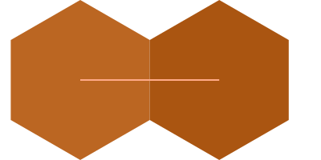

# Malla hexagonal en SVG

## Un sólo hexágono

Un hexágono regular es un polígono de seis lados cuyos vértices son equidistantes entre sí, y equidistantes respecto al centro del círculo en en cual se inscribe.

Por tanto, podemos generar un hexágono en SVG usando la tag `<polygon>` e introduciendo las coordenadas de cada uno de los seis vértices.

```html
<polygon points="x1,y1 x2,y2 ..." />
```

Para obtener las coordenadas de los vertices, tenemos que tener en cuenta dos cosas:

- que los ejes x e y, en SVG, tienen como origen de coordenadas la esquina superior izquierda, donde `x` crece de izquierda a derecha, e `y` crece de arriba a abajo (contrariamente esto último al plano de coordenadas cartesianas habitual). 

- que las coordenadas de cada vértice han de expresarse en este plano cartesiano como `(x,y)`.


Sin embargo, para obtener un hexágono regular tenemos que partir de un círculo en el cual dibujaremos los vértices equiespaciados por 60º, que es la sexta parte de los 360º de la circunferencia. Rotaremos 30º nuestro polígono para que haya vértices arriba y abajo, y lados a izquierda y derecha. Con lo cual podemos usar la siguiente ecuación para obtener el ángulo que forma cada vértice:

θ<sub>z</sub> = 60z - 30º

Y convertimos de polares a cartesianas mediante la fórmula:

v<sub>z</sub>(x,y) = (Rcos(θ<sub>z</sub>), Rsen(θ<sub>z</sub>))

Es decir, estableciendo un radio de 100 px:

ρ<sub>1</sub>(R,θ) = (100, 30º) => **v<sub>1</sub>(x,y) = (86.6, 50)**

ρ<sub>2</sub>(R,θ) = (100, 90º) => **v<sub>2</sub>(x,y) = (0, 100)**

ρ<sub>3</sub>(R,θ) = (100, 150º) => **v<sub>3</sub>(x,y) = (-86.6, 50)**

ρ<sub>4</sub>(R,θ) = (100, 210º) => **v<sub>4</sub>(x,y) = (-86.6, -50)**

ρ<sub>5</sub>(R,θ) = (100, 270º) => **v<sub>5</sub>(x,y) = (0, -100)**

ρ<sub>6</sub>(R,θ) = (100, 33º0) => **v<sub>6</sub>(x,y) = (86.6, -50)**

Ya tenemos todas las coordenadas de los vértices, suponiendo que el centro del hexágono es nuestro origen de coordenadas.


Pero si dibujamos el polígono sin más, nos encontraremos con que el origen de coordenadas del hexágono coincidirá con el del propio SVG. Por tanto, para poder visualizar el hexágono completo, necesitaremos hacer una translación.

Entonces, el SVG que generará nuestro hexágono será el siguiente:

```html
<svg version="1.1" width="200" height="200" xmlns="http://www.w3.org/2000/svg" xmlns:xlink="http://www.w3.org/1999/xlink">
  <polygon points="86.6,50 0,100 -86.6,50 -86.6,-50 0,-100 86.6,-50" transform="translate(100 100)" />
</svg>
```

En los SVGs incrustados en este documento, hemos optado por agrupar todo bajo una tag `<g>` y aplicar la translación al grupo completo, evitando tener que hacerlo con cada elemento individual y obteniendo el mismo resultado.

## Malla hexagonal

Ahora tenemos que generar una malla. La clave aquí estará en obtener cuál es la separación entre los centros de los hexágonos para poder ir replicándolos.

En la primera fila, ya sabemos que la distancia entre los centros de los hexágonos será el doble de la apotema en la dirección del eje x, luego la distancia de desplazamiento será:

d<sub>x</sub> = 2Rcos(30º) = 173.2



Y respecto al primer hexágono de la segunda fila, tendremos que hacer dos desplazamientos, uno en cada eje.

d<sub>x</sub> = Rcos(30º) = 86.6

d<sub>y</sub> = (R + R/2) = 150


